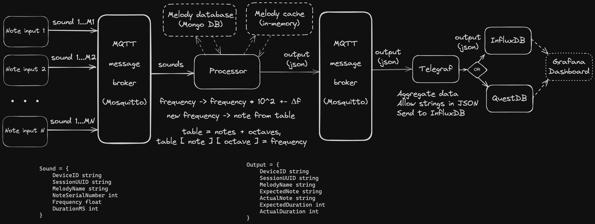

## Topics:
+ `sound/note` - default note input;
+ `sound/note/record` - topic for Telegraf to receive processed note;
+ `sound/file` (?? in case we receive different input from an actual guitar, e.g. WAV-file units etc.);

## System Design:
 

## Ручное тестирование
В корневой директории проекта использовать команду:
+ `make up` - для __ОС Linux__ (возможно и __Windows__);
+ `make mup` - для __MacOS__.

Эта команда запустит Docker Compose в detached моде для просмотра логов и дебагинга.

Для запуска имитации ввода звука необходимо отправить запрос на gRPC-сервер по адресу __*localhost:7249*__,
передав в качестве параметра `"file_path" = ./data/mock.yaml`.
Для этого подойдут приложение __*Postman*__ или утилита __*grpcurl*__.

Есть следующие значимые адреса:
+ `localhost:3000` - адрес для Grafana. Логин и пароль лежат открыто в файле __docker_compose.yaml__ в корне проекта.
+ `localhost:8086` - адрес для InfluxDB. Временно отключен.
+ `localhost:9000` - адрес для QuestDB.

В корне проекта также лежит файл __*dashboard.json*__, его можно закинуть в Grafana для отображения заранее подготовленного дашборда.